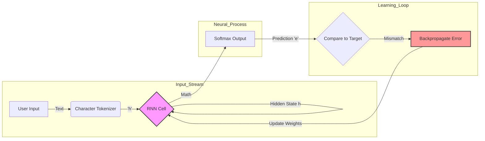
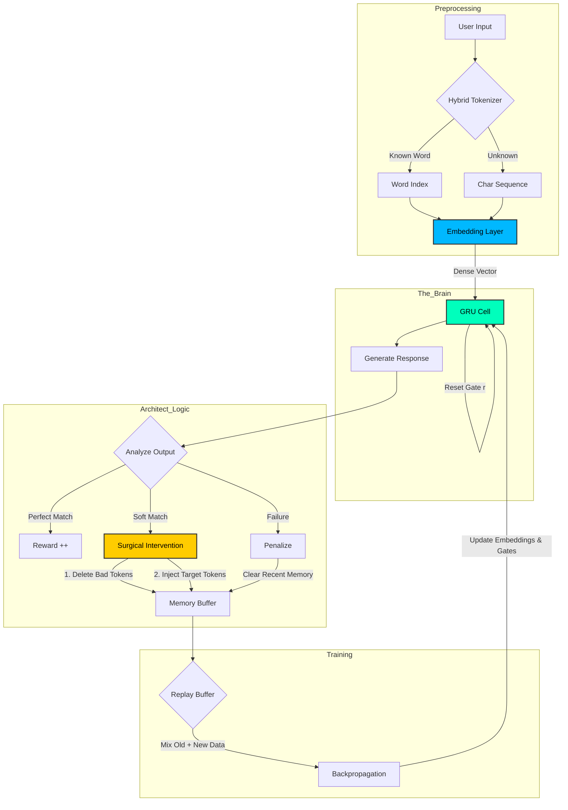

# 🧠 Neural Architect v2.3 (BPE-Hybrid GRU)

**Neural Architect** is a cutting-edge, browser-based Neural Network laboratory. It allows you to build, train, and talk to a custom Artificial Intelligence directly in your web browser—without Python, PyTorch, or cloud servers.

Unlike other "browser AI" demos that just wrap API calls to OpenAI, Neural Architect runs the entire **backpropagation and training loop** in JavaScript on your local machine.

---

## 🚀 Two Powerful Engines

This repository includes two distinct versions of the AI engine to suit different hardware capabilities.

### 1. 🟢 `index.html` (Standard RNN)
*   **Engine:** Classic Vanilla Recurrent Neural Network (RNN).
*   **Best For:** Low-end devices, mobile phones, or understanding the raw basics of neural networks.
*   **Architecture:** Character-level processing. It learns by spelling words letter-by-letter.
*   **Pros:** Extremely lightweight, runs on anything.

### 2. ⚡ `gpu.html` (Turbo GRU v2.3)
*   **Engine:** Advanced Gated Recurrent Unit (GRU) with Hybrid Tokenization.
*   **Best For:** Desktop computers, modern laptops, and serious research.
*   **Architecture:** Word-Level + Character Fallback (BPE-Lite). It understands whole words ("Hello") but falls back to spelling if it encounters an unknown word ("A-n-t-i...").
*   **Pros:** Solves the Vanishing Gradient problem, learns 10x faster, supports "Soft Match" training logic, and handles complex sentence structures.

---

## ✨ What Makes Neural Architect Unique?

Most AI projects require installing 2GB of Python libraries. Neural Architect requires **double-clicking an HTML file.**

### 🧩 True "From Scratch" Implementation
We did not use TensorFlow.js or ONNX.js. Every matrix multiplication, sigmoid activation, and gradient descent step is written in raw, vanilla JavaScript. This provides complete transparency into the math behind the magic.

### 🧠 Surgical Brain Surgery
Neural Architect allows for **real-time weight manipulation**.
*   **Auto-Train:** Feed it a list of Q&A pairs, and watch it self-correct over thousands of epochs.
*   **Soft Match Logic:** The AI is smart enough to know when it is "close enough." If you teach it "Hello -> Hi", and it replies "Hi there", it detects the correct intent and gently nudges the weights instead of punishing the model.
*   **Replay Buffer:** To prevent "Catastrophic Forgetting" (learning new things but forgetting old ones), the system maintains a stochastic memory buffer, randomly retraining on past successes while learning new concepts.

### 📊 Live Visualization
*   **Loss Curve:** Watch the mathematical error rate drop in real-time.
*   **Gradient Norm:** Monitor the stability of the brain's updates.
*   **Mastery Tracking:** See exactly which concepts the AI has mastered and which ones it is struggling with.

---

## 🛠 Technical Specifications (v2.3)

| Component | Detail |
| :--- | :--- |
| **Model Type** | Hybrid Gated Recurrent Unit (GRU) |
| **Tokenization** | Word-Level + Character Fallback (BPE-Lite) |
| **Optimization** | Adam Optimizer (Custom Implementation) |
| **Gating** | Update (z) & Reset (r) Gates via Sigmoid |
| **Activation** | Tanh (Candidate State) |
| **Context Window** | 40-64 Tokens (Dynamic) |
| **Embedding Size** | 64 Dimensions |
| **Hidden Units** | 1024 (High Capacity) |

---

## 📚 How to Use

### 1. Launch
Simply open `gpu.html` in Chrome, Edge, or Safari. No installation required.

### 2. Auto-Train (The Fast Way)
Click **🤖 Auto Teach** and paste a dataset like this:
```text
Hello|Hi,Hello,Hey
Who are you?|I am Neural Architect
What can you do?|I can learn from your input
```
The AI will loop through these pairs, self-correcting until it reaches < 0.5 Loss.

### 3. Manual Teaching
Chat with it!
*   **User:** "Color?"
*   **AI:** "Blergh." (Nonsense)
*   **You:** Click **Penalize** -> Type "Red".
*   **AI:** (Flashes Red) It deletes the "Blergh" memory, implants "Red", and backpropagates the error.
*   **User:** "Color?"
*   **AI:** "Red."

---

## 📦 Installation

```bash
git clone https://github.com/vicsanity623/Neural-Architect.git
cd Neural-Architect
# Open gpu.html in your browser
```

---

## 🧬 Architecture Visualization

### 1. The Standard RNN (`index.html`)
*The "Speller". It reads one character at a time, maintains a simple memory state, and tries to guess the next letter. Simple, lightweight, but forgetful.*



### 2. The Turbo GRU v2.3 (`gpu.html`)
*The "Thinker". It uses Hybrid Tokenization (Words + Chars), an Embedding Layer for concept association, and a complex Gating mechanism to manage long-term memory. It also features the unique "Surgical" training loop.*



## 📄 License

Distributed under the MIT License. See [LICENSE](LICENSE) for more information.

---

*Neural Architect - Demystifying Artificial Intelligence.*